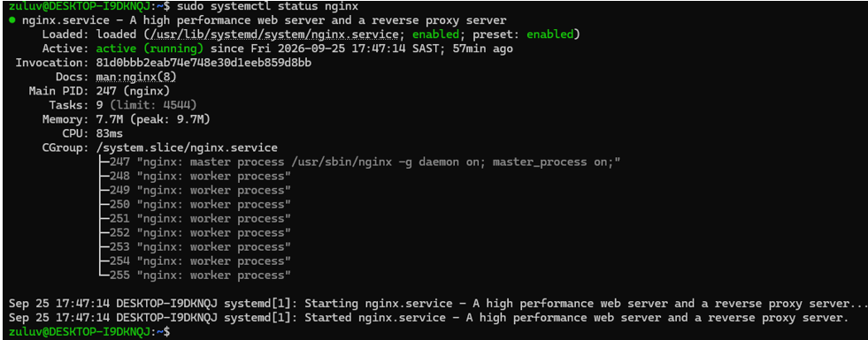
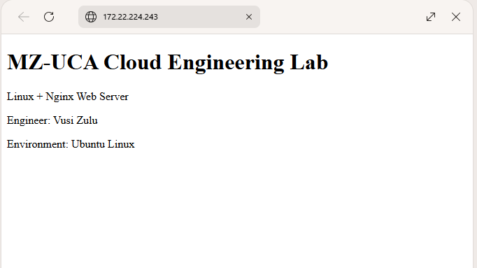
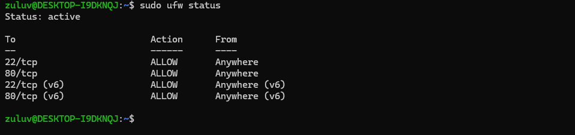
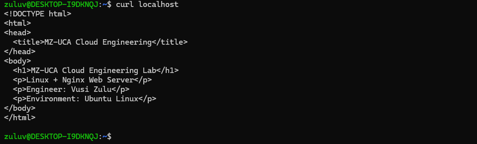
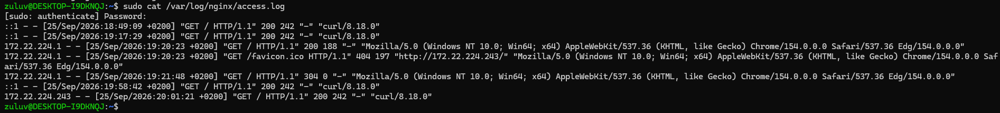
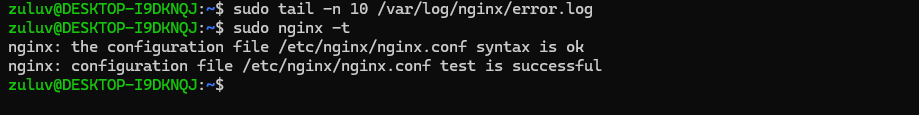

# Day 05 - Linux + Nginx Lab

## Labs Overview
This lab demonstrates Nginx setup, configuration, and troubleshooting.

## Skills Demonstrated
- Linux administration
- Nginx web server setup
- Firewall configuration
- Log inspection
- Troubleshooting

## Tools Used
- Ubuntu (WSL2)
- Nginx
- iptables
- GitHub
## Evidence Screenshots

